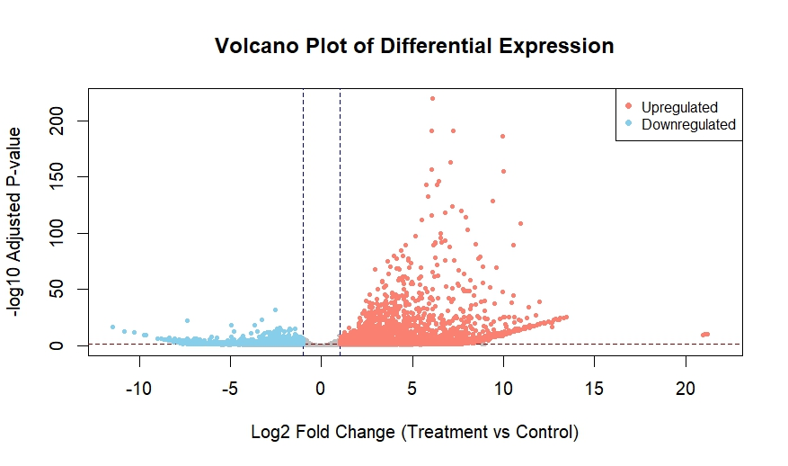
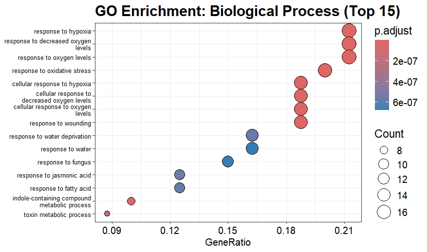

Differential Expression of Arabidopsis thaliana Vasculature under UV Stress  
HackBio Project Stage 2: RNA-Seq Analysis  

Author: Adeyeye Daniel Oludayo  

## Introduction  
Plants constantly face abiotic stresses such as drought, salinity, temperature extremes, and ultraviolet (UV) radiation. These stresses alter gene expression in specific tissues, enabling plants to adapt and survive. Arabidopsis thaliana, a model organism in plant biology, provides a well-characterized system for studying such responses.  

Berkowitz et al. (2021) showed that different Arabidopsis leaf tissues (epidermis, mesophyll, and vasculature) exhibit distinct transcriptional responses to abiotic stress. The vasculature, being central to transport and signaling, plays a crucial role in systemic stress responses. In this project, we focus on identifying genes that are differentially expressed in the vasculature of UV-treated tissues compared to water-treated controls.  

## Objectives  
- Perform differential expression analysis between UV-treated and control vasculature tissues.  
- Identify the top 100 differentially expressed genes.  
- Conduct pathway enrichment analysis to highlight the top 5 significantly enriched pathways.  
- Provide biological interpretation of the results.  

## Methods  
RNA-Seq data from Arabidopsis vasculature tissues were retrieved from the NCBI SRA (three biological replicates per condition). The workflow included:  

1. **Data Retrieval**: Downloading raw reads from SRA using accession numbers.  
2. **Quality Control**: Assessing and trimming reads with FastQC and Trimmomatic.  
3. **Alignment**: Mapping reads to the Arabidopsis reference genome with HISAT2.  
4. **Quantification**: Generating count matrices using featureCounts.  
5. **Differential Expression**: Performing DESeq2 analysis in R to identify UV-responsive genes.  
6. **Pathway Enrichment**: Analyzing DEGs with clusterProfiler to identify enriched biological pathways.  

This streamlined workflow ensures reproducible identification of UV-responsive genes in Arabidopsis vasculature.  

The following Bash scripts outline the steps from data download to read mapping and feature counting. Each block has comments for clarity and error handling to stop execution if a command fails.

---

### 1. Project Setup and Raw Data Download
Create project folders and download raw FASTQ files from SRA.

```bash
#!/usr/bin/env bash
set -e  # exit on error

# Create project directory
mkdir -p plant_project && cd plant_project

# Create raw data directory
mkdir -p rawfiles && cd rawfiles

# Download raw FASTQ files
curl -L ftp://ftp.sra.ebi.ac.uk/vol1/fastq/SRR128/097/SRR12808497/SRR12808497.fastq.gz -o SRR12808497.fastq.gz
curl -L ftp://ftp.sra.ebi.ac.uk/vol1/fastq/SRR128/099/SRR12808499/SRR12808499.fastq.gz -o SRR12808499.fastq.gz
curl -L ftp://ftp.sra.ebi.ac.uk/vol1/fastq/SRR128/029/SRR12808529/SRR12808529.fastq.gz -o SRR12808529.fastq.gz
curl -L ftp://ftp.sra.ebi.ac.uk/vol1/fastq/SRR128/028/SRR12808528/SRR12808528.fastq.gz -o SRR12808528.fastq.gz
curl -L ftp://ftp.sra.ebi.ac.uk/vol1/fastq/SRR128/027/SRR12808527/SRR12808527.fastq.gz -o SRR12808527.fastq.gz
curl -L ftp://ftp.sra.ebi.ac.uk/vol1/fastq/SRR128/098/SRR12808498/SRR12808498.fastq.gz -o SRR12808498.fastq.gz

cd ../
```

### 2. Quality Control of Raw Reads
Check sequencing quality with FastQC and summarize results using MultiQC.

```bash
#!/usr/bin/env bash
set -e

# Create output directory
mkdir -p qc

# Run FastQC on all raw files
for filename in rawfiles/*.fastq.gz; do
    fastqc -o qc/ "$filename"
done

# Summarize with MultiQC
mkdir -p multi_qc
multiqc qc/ -o multi_qc
```

### 3. Trimming and Post-trim QC
Trim adapters and low-quality bases using Fastp, then run QC again.

```bash
#!/usr/bin/env bash
set -e

# Trimming step
mkdir -p trim
for filename in rawfiles/*.fastq.gz; do
    base=$(basename "$filename" .fastq.gz)
    fastp -i "$filename" \
          -o "trim/${base}_trim.fastq.gz" \
          -h "trim/${base}_report.html"
done

# QC for trimmed files
mkdir -p trim_qc
for filename in trim/*.fastq.gz; do
    fastqc -o trim_qc/ "$filename"
done

# Summarize trimmed QC
mkdir -p trim_multi_qc
multiqc trim_qc/ -o trim_multi_qc
```
### 4. Genome Preparation
Download the Arabidopsis genome and prepare a STAR index.

```bash
#!/usr/bin/env bash
set -e

# Download reference genome
mkdir -p genome
wget -P genome https://ftp.ensemblgenomes.ebi.ac.uk/pub/plants/release-62/fasta/arabidopsis_thaliana/dna/Arabidopsis_thaliana.TAIR10.dna.toplevel.fa.gz
gunzip genome/Arabidopsis_thaliana.TAIR10.dna.toplevel.fa.gz
mv genome/Arabidopsis_thaliana.TAIR10.dna.toplevel.fa genome/a_thaliana.fa

# Build STAR index
mkdir -p genome/genomeIndex
STAR --runMode genomeGenerate \
     --genomeDir genome/genomeIndex \
     --genomeFastaFiles genome/a_thaliana.fa
```

### 5. Mapping Reads to Genome
Align trimmed reads to the reference using STAR.

```bash
#!/usr/bin/env bash
set -e

# Create directory for mapped reads
mkdir -p mapped

# Run STAR alignment
for infile in trim/*.fastq.gz; do
    outfile=$(basename "$infile" .fastq.gz)
    STAR --genomeDir genome/genomeIndex \
         --readFilesIn "$infile" \
         --readFilesCommand zcat \
         --outFileNamePrefix mapped/"$outfile" \
         --outSAMtype BAM SortedByCoordinate \
         --outSAMattributes All
done

# Prepare files for IGV visualization
mkdir -p IGV
cp mapped/*.bam IGV/
samtools index IGV/*.bam
```
### 6. Feature Counting
Count reads per gene using featureCounts.

```bash
#!/usr/bin/env bash
set -e

# Download GFF3 annotation file
wget -P genome/ https://ftp.ensemblgenomes.ebi.ac.uk/pub/plants/release-62/gff3/arabidopsis_thaliana/Arabidopsis_thaliana.TAIR10.62.gff3.gz
gunzip genome/Arabidopsis_thaliana.TAIR10.62.gff3.gz
mv genome/Arabidopsis_thaliana.TAIR10.62.gff3 genome/a_thaliana.gff3

# Run featureCounts
mkdir -p counts
featureCounts -O -t gene -g ID -a genome/a_thaliana.gff3 -o counts/counts.txt mapped/*.bam

# Display summary
cat counts/counts.txt.summary
```

---
### 7. Differential Expression and Enrichment Analysis in R

### Metadata
The sample information is stored in a metadata file (`metadata.tsv`) as shown below:
| sample | condition  |
|--------|------------|
| trt_1  | treatment  |
| trt_2  | treatment  |
| trt_3  | treatment  |
| ctr_1  | control    |
| ctr_2  | control    |
| ctr_3  | control    |

---

DESeq2 was used for differential expression, followed by visualization and pathway enrichment analysis (GO and KEGG).

```r
# Set working directory
setwd('/Users/HP/Documents/HACKBIO/PlantProject/')

# Load required packages
suppressPackageStartupMessages({
  library(DESeq2)
  library(pheatmap)
  library(dplyr)
  library(ggplot2)
  library(clusterProfiler)
  library(KEGGREST)
  library(DOSE)
  library(org.At.tair.db)
  library(enrichplot)
})

# 1. Load count matrix and metadata
a_t_count <- read.delim('counts.txt', header = TRUE)
a_t_meta  <- read.delim('metadata.tsv', header = TRUE, stringsAsFactors = TRUE)

# Preview
head(a_t_count)
head(a_t_meta)

# Keep raw counts for replicates (cols 7–12 in counts.txt)
raw_counts <- a_t_count[ , c(1, 7:12) ]
rownames(raw_counts) <- a_t_count$Geneid   # set rownames
raw_counts <- raw_counts[ , -1 ]           # drop Geneid column


# 2. Differential expression with DESeq2
a_t_meta$condition <- factor(a_t_meta$condition, levels = c("control", "treatment"))

dds <- DESeqDataSetFromMatrix(countData = raw_counts,
                              colData   = a_t_meta,
                              design    = ~ condition)

dds       <- DESeq(dds)
final_res <- results(dds)

# Summary of results
head(final_res)
summary(final_res)

# Subset significant DEGs
upregulated   <- subset(final_res, padj < 0.05 & log2FoldChange > 1)
downregulated <- subset(final_res, padj < 0.05 & log2FoldChange < -1)


# 3. Visualization: Volcano Plot
plot(final_res$log2FoldChange,
     -log10(final_res$padj),
     pch = 19, cex = 0.4, col = "grey",
     xlab = "Log2 Fold Change",
     ylab = "-log10 Adjusted P-value",
     main = "Volcano Plot: UV vs Control")

# Thresholds
abline(v = c(-1, 1), col = "darkblue", lty = 2)
abline(h = -log10(0.05), col = "darkred", lty = 2)

# Highlight DEGs
points(upregulated$log2FoldChange,   -log10(upregulated$padj), col = "salmon",  pch = 19, cex = 0.6)
points(downregulated$log2FoldChange, -log10(downregulated$padj), col = "skyblue", pch = 19, cex = 0.6)

legend("topright", legend = c("Upregulated", "Downregulated"),
       col = c("salmon", "skyblue"), pch = 19, cex = 0.8)


# 4. Heatmap of Top 50 DEGs
vsd <- vst(dds, blind = FALSE)
vsd_mat <- assay(vsd)

sig_degs   <- subset(final_res, padj < 0.05)
top50_genes <- head(sig_degs[order(sig_degs$padj), ], 50)
vsd_top50  <- vsd_mat[rownames(top50_genes), ]

# Clean gene names
clean_names <- gsub("^gene:?\\s*", "", rownames(vsd_top50))
rownames(vsd_top50) <- clean_names

# Sample annotation
sample_group <- data.frame(Condition = colData(dds)$condition)
rownames(sample_group) <- colnames(vsd_top50)
colnames(sample_group) <- " "

# Colors for conditions
ann_colors <- list(" " = c("control" = "skyblue", "treatment" = "tomato"))

# Plot heatmap
pheatmap(vsd_top50, cluster_rows = TRUE, cluster_cols = TRUE,
         show_rownames = TRUE,
         annotation_col = sample_group,
         annotation_colors = ann_colors,
         color = colorRampPalette(c("blue", "white", "red"))(50),
         main = "Top 50 DEGs Heatmap")


# 5. Extract Top 100 DEGs
sig_degs <- final_res %>%
  as.data.frame() %>%
  filter(!is.na(padj)) %>%
  filter(abs(log2FoldChange) > 2.5, padj < 0.05)

top100_degs <- sig_degs %>%
  arrange(padj) %>%
  head(100)

head(top100_degs)


# 6. GO Enrichment (BP, MF, CC)
gene_list <- gsub("^gene:", "", rownames(top100_degs))
gene_entrez <- mapIds(org.At.tair.db, keys = gene_list,
                      column = "ENTREZID", keytype = "TAIR",
                      multiVals = "first")
entrez_ids <- na.omit(gene_entrez)

ego_BP <- enrichGO(gene = entrez_ids, OrgDb = org.At.tair.db,
                   keyType = "ENTREZID", ont = "BP",
                   pAdjustMethod = "BH", pvalueCutoff = 0.05, qvalueCutoff = 0.05)

ego_MF <- enrichGO(gene = entrez_ids, OrgDb = org.At.tair.db,
                   keyType = "ENTREZID", ont = "MF",
                   pAdjustMethod = "BH", pvalueCutoff = 0.05, qvalueCutoff = 0.05)

ego_CC <- enrichGO(gene = entrez_ids, OrgDb = org.At.tair.db,
                   keyType = "ENTREZID", ont = "CC",
                   pAdjustMethod = "BH", pvalueCutoff = 0.05, qvalueCutoff = 0.05)

# Merge results
BP_on <- as.data.frame(ego_BP); BP_on$Ontology <- "BP"
MF_on <- as.data.frame(ego_MF); MF_on$Ontology <- "MF"
CC_on <- as.data.frame(ego_CC); CC_on$Ontology <- "CC"
GO_merged <- rbind(BP_on, MF_on, CC_on)

# Dotplots
dotplot(ego_BP, showCategory = 15) + ggtitle("GO: Biological Process")
dotplot(ego_MF, showCategory = 10) + ggtitle("GO: Molecular Function")
dotplot(ego_CC, showCategory = 20) + ggtitle("GO: Cellular Component")


# 7. KEGG Enrichment
tair_ids <- gsub("^gene:?\\s*", "", rownames(final_res))
de_tair  <- tair_ids[final_res$padj < 0.05 & abs(final_res$log2FoldChange) > 1]

ekegg <- enrichKEGG(gene = de_tair, organism = "ath", keyType = "kegg",
                    pAdjustMethod = "BH", qvalueCutoff = 0.05)

# Top 5 pathways
top5_kegg <- as.data.frame(ekegg) %>% arrange(p.adjust) %>% head(5)
top5_kegg

dotplot(ekegg, showCategory = 30) + ggtitle("KEGG Enrichment")


# 8. Save Outputs
write.csv(final_res,         "Final_DESeq2_Results.csv")
write.csv(upregulated,       "Upregulated_Genes.csv")
write.csv(downregulated,     "Downregulated_Genes.csv")
write.csv(raw_counts,        "Raw_counts.csv")
write.csv(top100_degs,       "Top100_DEGs.csv", row.names = TRUE)
write.csv(as.data.frame(ego_BP), "GO_BP_results.csv", row.names = FALSE)
write.csv(as.data.frame(ego_MF), "GO_MF_results.csv", row.names = FALSE)
write.csv(as.data.frame(ego_CC), "GO_CC_results.csv", row.names = FALSE)
write.csv(GO_merged,             "GO_Enrichment_Merged.csv", row.names = FALSE)
write.csv(as.data.frame(ekegg),  "KEGG_Top100_DEGs.csv", row.names = FALSE)
write.csv(top5_kegg,             "Top5_KEGG_Pathways.csv", row.names = FALSE)
```

## Discussion and Conclusion

## Results

### 1. Differential Expression Overview  
Out of 23,565 expressed genes, 5,546 were identified as significant differentially expressed genes (DEGs) at padj < 0.1. Of these, 3,329 were upregulated and 2,217 were downregulated. Approximately 1% of genes were removed as outliers and 17% were filtered out due to low counts, making them unreliable for differential testing. The thresholds applied were |log2 fold change| > 2.5 and adjusted p-value < 0.05 for significance.

---

#### Upregulated Genes
In total, 2,700 genes showed significant upregulation. Among the strongest signals, **AT3G19184, AT4G38830, and AT1G77655** had extremely high log2 fold changes (>20), indicating strong induction under treatment. Other notable upregulated genes, such as **AT2G30770 and AT4G22710**, combined both high baseMean values and strong fold changes, suggesting robust transcriptional activation. These genes may be directly linked to stress-response pathways and transcriptional reprogramming.

---

#### Downregulated Genes  
A total of 1,453 genes were significantly downregulated. Genes such as **AT1G53160 and AT4G39250** displayed large negative fold changes (log2FC < -10), highlighting severe repression under treatment. Other downregulated candidates, including **AT4G15670 and AT5G50820**, showed moderate expression levels but strong suppression, likely representing processes actively switched off in response to stress. These findings point toward selective silencing of metabolic or growth-related genes during the treatment response.

---

#### Top Significant Genes  
The table below presents the top 20 most significant DEGs (|log2FC| > 2.5 and padj < 0.05).

| Gene ID     | baseMean   | log2FC   | p-adj        |
|-------------|------------|----------|--------------|
| AT4G20830   | 7065.32    | 6.09     | 1.95E-220    |
| AT2G38470   | 5133.90    | 7.24     | 8.69E-192    |
| AT4G20835   | 6436.93    | 6.05     | 2.10E-191    |
| AT3G26830   | 4929.44    | 9.95     | 1.65E-186    |
| AT1G05680   | 2889.96    | 7.08     | 2.72E-163    |
| AT2G41105   | 5115.84    | 6.03     | 4.28E-157    |
| AT2G18193   | 3597.52    | 10.00    | 1.03E-155    |
| AT4G02380   | 3147.12    | 6.45     | 9.05E-147    |
| AT1G19180   | 3774.36    | 5.75     | 4.17E-144    |
| AT2G47000   | 5461.11    | 6.35     | 1.82E-143    |
| AT2G41100   | 9320.02    | 5.84     | 4.47E-133    |
| AT1G72520   | 2261.32    | 9.41     | 1.77E-129    |
| AT1G02930   | 2230.10    | 7.18     | 3.24E-124    |
| AT3G63380   | 1954.38    | 7.69     | 7.58E-121    |
| AT1G80840   | 2507.67    | 6.81     | 3.91E-119    |
| AT3G22370   | 2255.29    | 6.03     | 2.44E-116    |
| AT4G37370   | 1711.12    | 7.93     | 4.15E-115    |
| AT4G02520   | 2653.80    | 5.50     | 1.24E-112    |
| AT3G28580   | 3093.96    | 10.91    | 2.55E-109    |
| AT5G13210   | 1465.64    | 8.01     | 9.55E-104    |


**Interpretation:**  
These genes represent the strongest transcriptional signals, combining high expression (baseMean > 2000 in many cases) with large log2FC (>5) and extremely significant adjusted p-values. Genes such as **AT3G28580 and AT2G18193** had log2FC values above 10, marking them as potential key regulators of stress adaptation. Meanwhile, consistently high baseMean values (e.g., AT2G41100, AT4G20830) indicate both strength and stability of transcriptional changes. Collectively, this group highlights candidate markers for functional validation.

---

### 2. Plot and Heatmap Interpretation



The volcano plot clearly shows asymmetry between upregulated (red) and downregulated (blue) genes. A large cluster of significantly upregulated genes with high log2 fold changes (>5) dominates the right side, while fewer strongly downregulated genes appear on the left. This suggests that the treatment triggered a stronger activation of stress-response pathways than repression of basal processes.

---

#### Heatmap Interpretation  


The heatmap of the top 50 DEGs shows a clear separation between treatment and control groups. Controls cluster tightly with high expression of downregulated genes (blue), whereas treatments cluster together with strong upregulation (red) of specific gene sets. This clustering pattern reinforces that the treatment induced a consistent and reproducible transcriptomic shift across replicates.

---


### 3.GO Enrichment Analysis
Gene Ontology (GO) enrichment was performed to explore the functional themes of differentially expressed genes under UV stress in the vasculature of Arabidopsis thaliana. Significant terms were identified across the three domains: Biological Process (BP), Molecular Function (MF), and Cellular Component (CC).

***Top 20 Enriched GO Terms across Categories***
| ID         | Description                                         | Count | Ontology |
| ---------- | --------------------------------------------------- | ----- | -------- |
| GO:0001666 | response to hypoxia                                 | 17    | BP       |
| GO:0036293 | response to decreased oxygen levels                 | 17    | BP       |
| GO:0070482 | response to oxygen levels                           | 17    | BP       |
| GO:0071456 | cellular response to hypoxia                        | 15    | BP       |
| GO:0036294 | cellular response to decreased oxygen levels        | 15    | BP       |
| GO:0071453 | cellular response to oxygen levels                  | 15    | BP       |
| GO:0009611 | response to wounding                                | 15    | BP       |
| GO:0006979 | response to oxidative stress                        | 16    | BP       |
| GO:0042430 | indole-containing compound metabolic process        | 8     | BP       |
| GO:0009404 | toxin metabolic process                             | 7     | BP       |
| GO:0009414 | response to water deprivation                       | 11    | BP       |
| GO:0010817 | regulation of hormone levels                        | 15    | BP       |
| GO:0009725 | response to hormone                                 | 16    | BP       |
| GO:0071214 | cellular response to abiotic stimulus               | 14    | BP       |
| GO:0009737 | response to abscisic acid                           | 12    | BP       |
| GO:0071417 | cellular response to organonitrogen compound        | 12    | BP       |
| GO:0009733 | response to auxin                                   | 12    | BP       |
| GO:0009753 | response to jasmonic acid                           | 10    | BP       |
| GO:0009620 | response to fungus                                  | 9     | BP       |
| GO:0009751 | response to salicylic acid                          | 8     | BP       |
| GO:0043295 | glutathione binding                                 | 3     | MF       |
| GO:0004364 | glutathione transferase activity                    | 4     | MF       |
| GO:0042626 | ATPase-coupled transmembrane transporter activity   | 6     | MF       |
| GO:0140359 | ABC-type transporter activity                       | 3     | MF       |
| GO:0016829 | lyase activity                                      | 6     | MF       |
| GO:0016811 | hydrolase activity, acting on carbon-nitrogen bonds | 5     | MF       |
| GO:0008234 | cysteine-type peptidase activity                    | 6     | MF       |
| GO:0004672 | protein kinase activity                             | 10    | MF       |
| GO:0019901 | protein kinase binding                              | 7     | MF       |
| GO:0005509 | calcium ion binding                                 | 14    | MF       |
| GO:0003700 | DNA-binding transcription factor activity           | 15    | MF       |
| GO:0005524 | ATP binding                                         | 20    | MF       |
| GO:0004674 | protein serine/threonine kinase activity            | 9     | MF       |
| GO:0043565 | sequence-specific DNA binding                       | 11    | MF       |
| GO:0005515 | protein binding                                     | 35    | MF       |
| GO:0000166 | nucleotide binding                                  | 23    | MF       |
| GO:0016301 | kinase activity                                     | 12    | MF       |
| GO:0016740 | transferase activity                                | 18    | MF       |
| GO:0005488 | binding                                             | 62    | MF       |
| GO:0010494 | cytoplasmic stress granule                          | 5     | CC       |
| GO:0036464 | cytoplasmic ribonucleoprotein granule               | 5     | CC       |
| GO:0035770 | ribonucleoprotein granule                           | 5     | CC       |
| GO:0048046 | apoplast                                            | 6     | CC       |
| GO:0099080 | supramolecular complex                              | 6     | CC       |




The enrichment results show that UV stress in the vasculature strongly activates oxygen- and redox-related processes (e.g., hypoxia and oxidative stress) together with hormonal signaling pathways such as abscisic acid, auxin, jasmonic acid, and salicylic acid responses. This reflects both abiotic stress adaptation and defense priming. On the functional side, enrichment in glutathione activity, protein kinases, and transcription factors indicates detoxification, signaling, and transcriptional regulation are central mechanisms. Finally, enrichment in stress granules, ribonucleoprotein complexes, and the apoplast highlights the role of RNA regulation and extracellular communication in coordinating stress responses.

### 4. KEGG Pathway Enrichment

To complement the GO analysis, KEGG pathway enrichment was performed to identify metabolic and signaling pathways involved in the UV stress response. Top Five significantly enriched pathways were detected and discussed, highlighting both detoxification mechanisms and signal transduction processes.

***Top Enriched KEGG Pathways***
| ID       | Pathway                           | Count |
| -------- | --------------------------------- | ----- |
| ath00480 | Glutathione metabolism            | 4     |
| ath00940 | Phenylpropanoid biosynthesis      | 3     |
| ath04016 | MAPK signaling pathway – plant    | 5     |
| ath04075 | Plant hormone signal transduction | 7     |
| ath04146 | Peroxisome                        | 5     |


The enriched KEGG pathways align with the GO results, emphasizing the central role of glutathione metabolism in counteracting oxidative damage and maintaining redox balance. Phenylpropanoid biosynthesis further reflects activation of secondary metabolites that strengthen structural and chemical defenses. In parallel, the enrichment of MAPK signaling and plant hormone signaling pathways demonstrates extensive cross-talk between stress signaling cascades and hormonal regulation. The involvement of peroxisomes highlights their importance in reactive oxygen species (ROS) metabolism and lipid turnover, further supporting adaptation to UV-induced oxidative stress.


## Conclusion  

This analysis revealed that UV stress in the vascular tissue of *Arabidopsis thaliana* triggered a strong transcriptional reprogramming dominated by upregulation of defense-related genes. The top 20 DEGs, including **AT3G28580, AT2G18193, and AT1G72520**, showed extreme fold changes, suggesting they may act as core regulators of the stress response.  

Functional enrichment supported these findings. GO Biological Process terms were enriched for **response to stimulus, defense response, and regulation of transcription**, while Molecular Function terms highlighted **DNA-binding transcription factor activity and kinase activity**. The enriched Cellular Component terms, such as **nucleus and plasma membrane**, indicate that UV stress signaling involves both nuclear regulation and membrane-associated sensing mechanisms.  

KEGG pathway analysis further reinforced the central role of stress adaptation, with significant enrichment in **plant hormone signal transduction, MAPK signaling pathway, phenylpropanoid biosynthesis, and glutathione metabolism**. These pathways are directly involved in coordinating perception of environmental stress, activating protective cascades, and maintaining cellular redox balance.  

Together, the DEG patterns, GO enrichments, and KEGG pathways paint a consistent picture: UV stress drives a coordinated vascular response in *A. thaliana*, shifting resources away from growth toward defense signaling, transcriptional control, and metabolic adjustment. This provides candidate genes and pathways that can be prioritized in future studies aimed at improving plant resilience to abiotic stress.

## References

Berkowitz, O., Xu, Y., Liew, L. C., Wang, Y., Zhu, Y., Hurgobin, B., Lewsey, M. G., & Whelan, J. (2021). RNA-seq analysis of laser microdissected Arabidopsis thaliana leaf epidermis, mesophyll and vasculature defines tissue-specific transcriptional responses to multiple stress treatments. The Plant Journal, 107(3), 938–955. https://doi.org/10.1111/tpj.15314

Hartman, S., Liu, Z., van Veen, H., Vicente, J., Reinen, E., Martopawiro, S., … (et al.). (2019). Ethylene-mediated nitric oxide depletion pre-adapts plants to hypoxia stress. Nature Communications, 10, 4020.

Hartmann, A., Berkowitz, O., Whelan, J., … (et al.). (2022). Cross-species transcriptomic analyses reveals common and opposite responses in Arabidopsis, rice and barley following oxidative stress and hormone treatment. BMC Plant Biology, 22, 62. https://doi.org/10.1186/s12870-021-03406-7

Ivanova, A., Law, S. R., Narsai, R., Duncan, O., Lee, J. H., Zhang, B., Van Aken, O., Radomiljac, J., Van der Merwe, M., Yi, K., & Whelan, J. M. (2014). A functional antagonistic relationship between auxin and mitochondrial retrograde signaling regulates alternative oxidase1a expression in Arabidopsis. Plant Physiology, 165(3), 1233–1254. https://doi.org/10.1104/pp.114.237495

Ye, B.-B., Shang, G.-D., Pan, Y., Xu, Z.-G., Zhou, C.-M., Mao, Y.-B., … (et al.). (2020). AP2/ERF transcription factors integrate age and wound signals for root regeneration. The Plant Cell, 32, 226–241.

Ye, Q., Wang, H., Su, T., Wu, W. H., & Chen, Y. F. (2018). The ubiquitin E3 ligase PRU1 regulates WRKY6 degradation to modulate phosphate homeostasis in response to low-Pi stress in Arabidopsis. The Plant Cell, 30(5), 1062–1076. https://doi.org/10.1105/tpc.17.00845

